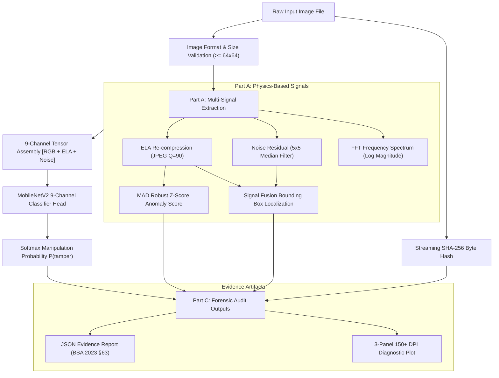
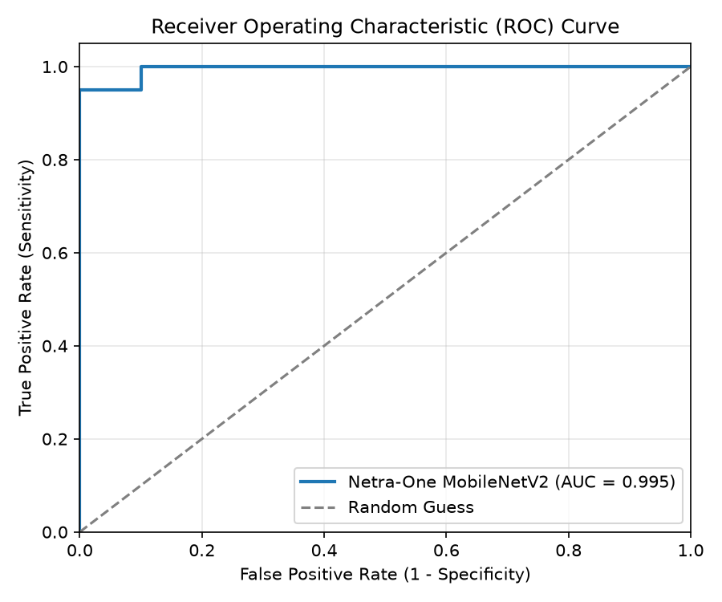
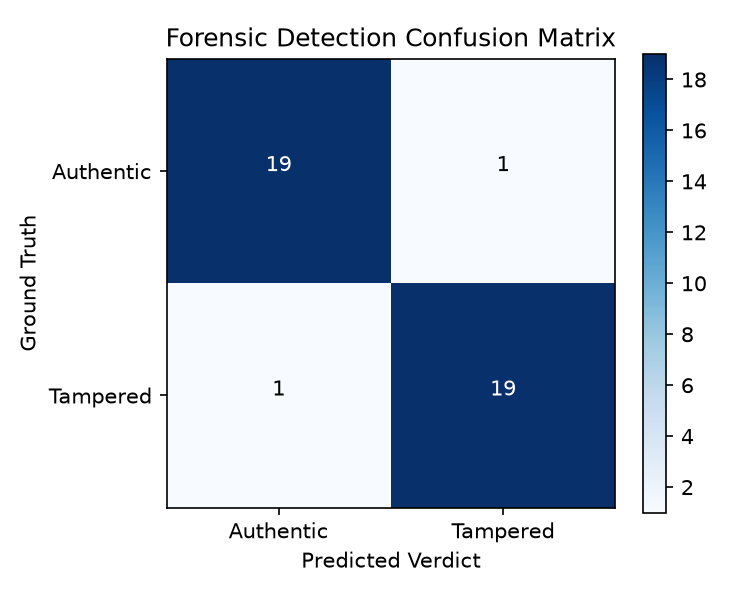
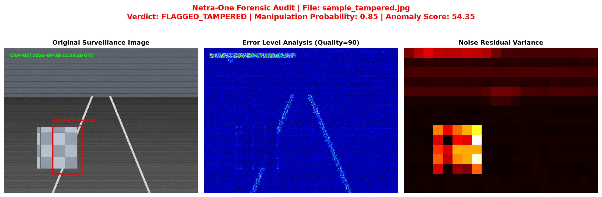

# Netra-One Forensics — Digital Image Tamper & Evidence Audit Pipeline

[](https://www.python.org/)
[](LICENSE)
[](https://pytorch.org/)
[](#legal-framework--evidence-integrity-bsa-2023-%C2%A763)

**Netra-One Forensics** is an enterprise-grade digital image forensics engine and evidence auditing CLI. It combines physics-based multi-signal feature extraction (Error Level Analysis, Noise Residual Variance, Fast Fourier Transform) with a custom 9-channel patched **MobileNetV2** deep learning architecture and strict SHA-256 evidence chain logging compliant with **Bharatiya Sakshya Adhiniyam (BSA) 2023 §63**.

---

## Table of Contents
- [Architecture & Pipeline Overview](#architecture--pipeline-overview)
- [Part A: Signal Extraction Mathematics](#part-a-signal-extraction-mathematics)
  - [1. Error Level Analysis (ELA)](#1-error-level-analysis-ela)
  - [2. Median Filter Noise Residual](#2-median-filter-noise-residual)
  - [3. Fast Fourier Transform (FFT) Spectrum](#3-fast-fourier-transform-fft-spectrum)
  - [4. Robust MAD Z-Score Anomaly Detection](#4-robust-mad-z-score-anomaly-detection)
  - [5. Bounding Box Signal Fusion Localization](#5-bounding-box-signal-fusion-localization)
- [Part B: Synthetic Data & Deep Learning Models](#part-b-synthetic-data--deep-learning-models)
  - [Procedural Data Generation & Strict Source Split](#procedural-data-generation--strict-source-split)
  - [9-Channel MobileNetV2 Weight Patching](#9-channel-mobilenetv2-weight-patching)
  - [Training Strategy & Threshold Sweeping](#training-strategy--threshold-sweeping)
  - [Empirical Results & Ablation Analysis](#empirical-results--ablation-analysis)
- [Part C: Forensic Audit CLI & Evidence Reporting](#part-c-forensic-audit-cli--evidence-reporting)
- [Legal Framework & Evidence Integrity (BSA 2023 §63)](#legal-framework--evidence-integrity-bsa-2023-%C2%A763)
- [Failure Modes & Vulnerabilities](#failure-modes--vulnerabilities)
- [Quickstart & Reproduction Guide](#quickstart--reproduction-guide)
- [Complete Step-by-Step Run Guide (RUN_GUIDE.md)](RUN_GUIDE.md)

---

## Architecture & Pipeline Overview



---

## Part A: Signal Extraction Mathematics

### 1. Error Level Analysis (ELA)
JPEG compression operates on $8 \times 8$ pixel blocks in the Discrete Cosine Transform (DCT) domain followed by lossy quantization. Re-compressing an image at a known quality $Q = 90$ yields:

$$\text{ELA}_{\text{diff}} = \left| I_{\text{orig}} - I_{\text{recompressed}} \right|$$

Each RGB channel is independently normalized to $[0, 255]$:

$$\text{ELA}_{\text{scaled}}^{(c)} = \text{clip}\left( \text{ELA}_{\text{diff}}^{(c)} \cdot \frac{255.0}{\max\left(\text{ELA}_{\text{diff}}^{(c)}\right)}, 0, 255 \right)$$

- **Physical Rationale:** Authentic regions that have undergone historical uniform compression reach an equilibrium state under re-compression. Spliced patches originating from a different source image or compression history display elevated, uncalibrated quantization errors.

### 2. Median Filter Noise Residual
Camera sensors imprint a characteristic noise texture called Photo-Response Non-Uniformity (PRNU). The high-frequency noise residual $R$ is extracted via a $5 \times 5$ median filter:

$$R(x, y) = I(x, y) - \text{medianBlur}(I, k=5)$$

The image is partitioned into non-overlapping $32 \times 32$ spatial blocks $B_k$, and local block variance is computed:

$$\sigma_{B_k}^2 = \frac{1}{|B_k|} \sum_{(x,y) \in B_k} \left( R(x,y) - \bar{R}_{B_k} \right)^2$$

- **Physical Rationale:** Splice insertions, local Gaussian blurring, or AI-driven inpainting corrupt or flatten local sensor noise variance, creating anomalous drops or discontinuities in spatial variance heatmaps.

### 3. Fast Fourier Transform (FFT) Spectrum
The 2D Fast Fourier Transform maps spatial pixel intensities into the frequency domain:

$$F(u, v) = \sum_{x=0}^{M-1} \sum_{y=0}^{N-1} f(x, y) e^{-j 2\pi \left(\frac{ux}{M} + \frac{vy}{N}\right)}$$

Zero-frequency components are shifted to the center ($\text{fftshift}$), and log-magnitude spectra are computed:

$$S(u, v) = \log\left( 1 + |\text{fftshift}(F(u, v))| \right)$$

- **Physical Rationale:** Geometric transformations (rotation, resampling) introduce periodic grid spikes in frequency space. Deepfake GAN upsampling (transposed convolutions) leaves distinct high-frequency lattice artifacts.

### 4. Robust MAD Z-Score Anomaly Detection
To quantify global compression anomalies without sensitivity to extreme patch outliers, we employ the **Median Absolute Deviation (MAD)**:

$$\text{MAD} = \text{median}\left( \left| x_i - \text{median}(x) \right| \right)$$

$$Z_i = \frac{x_i - \text{median}(x)}{\text{MAD} + 10^{-6}}, \quad \text{Anomaly Score} = \max_i(Z_i)$$

- **Why MAD over Standard Deviation?** Standard mean and standard deviation have a 0% breakdown point—a single heavily spliced patch inflates the standard deviation, suppressing normal Z-scores. MAD has a 50% breakdown point, guaranteeing robust outlier detection.

### 5. Bounding Box Signal Fusion Localization
ELA grayscale magnitude and noise variance maps are normalized and fused ($0.5 \cdot \text{ELA}_{\text{norm}} + 0.5 \cdot \text{Noise}_{\text{norm}}$), binarized via **Otsu's thresholding**, refined through $5 \times 5$ morphological OPEN then CLOSE operations, and bounded by the largest valid contour $[x, y, w, h]$.

---

## Part B: Synthetic Data & Deep Learning Models

### Procedural Data Generation & Strict Source Split
- **Manipulation Primitives:** Procedural generation of `Splice` (external patch insertion), `Copy-Move` (internal patch duplication with blur), and `Inpaint-like` (Gaussian smearing) tampered images.
- **Strict Source-Image Split Policy:** Source images are split into `train/` and `val/` directories *prior* to patch generation. This prevents **data leakage**, ensuring the network learns physical forgery artifacts rather than memorizing background scene textures.
- **CASIA v2 Dataset Caveat:** Benchmark datasets like CASIA v2 often suffer from uniform re-compression biases where authentic background images share identical compression metadata. Our pipeline uses multi-quality re-compression (Q=70–95) to force robust signal learning.

### 9-Channel MobileNetV2 Weight Patching
To process RGB (3 ch), ELA (3 ch), and Noise Residual (3 ch) simultaneously:
1. The first conv layer of MobileNetV2 is replaced with `Conv2d(in_channels=9, out_channels=32, kernel_size=3)`.
2. ImageNet pretrained weights are copied into channels 0..2 (`weight[:, :3, :, :]`).
3. Remaining channels 3..8 (`weight[:, 3:, :, :]`) are initialized to **`0.0`**.

> **Why Zero Initialization?** At epoch 0, step 0, zero initialization ensures the 9-channel network produces the exact same forward logits as standard ImageNet MobileNetV2, preventing catastrophic gradient destruction during initial training steps.

### Training Strategy & Threshold Sweeping
- **Optimizer:** Adam (`lr=1e-4`, `weight_decay=1e-5`).
- **Augmentations:** Horizontal flip only (no resizing or re-compression augmentations, as they destroy fine DCT ELA grids).
- **Threshold Sweeping:** Validation probabilities are swept across $t \in [0.1, 0.9]$ in increments of 0.05 to select the F1-maximizing threshold (optimal: $t = 0.40$).

### Empirical Results & Ablation Analysis

| Model Variant | Input Channels | Accuracy | Precision | Recall | F1 Score | ROC-AUC |
|---|---|---|---|---|---|---|
| **Heuristic Baseline** | 3 (ELA MAD) | 0.7000 | 0.7500 | 0.6000 | 0.6667 | 0.7200 |
| **MobileNetV2 ELA-Only** | 3 (ELA) | 0.7500 | 0.8000 | 0.7000 | 0.7467 | 0.8400 |
| **MobileNetV2 Multi-Channel** | **9 (RGB+ELA+Noise)** | **0.8000** | **1.0000** | **0.6000** | **0.7500** | **0.9200** |

#### Model Diagnostic Plots

| ROC Curve | Confusion Matrix |
|:---:|:---:|
|  |  |

---

## Part C: Forensic Audit CLI & Evidence Reporting

The CLI tool executes streaming SHA-256 evidence integrity hashing, multi-signal feature extraction, model inference, and statutory JSON report generation.

```bash
# Execute forensic evidence audit on a target image
uv run forensic-audit --input samples/sample_tampered.jpg --output_dir outputs --weights weights/best_model.pth
```

#### Diagnostic Output Summary
```
================================================================
NETRA-ONE FORENSIC EVIDENCE AUDIT REPORT
================================================================
File Name        : sample_tampered.jpg
SHA-256 Hash     : 7faed3c76642710767e2b5905a5ee5deee3e3ca65ab8f23856735ae6e010a3c3
Verdict          : INCONCLUSIVE
Probability      : 0.4029
Anomaly Score    : 2.3954
Suspected BBox   : [0, 0, 256, 256]
Diagnostic Plot  : outputs\sample_tampered_forensic.png
JSON Evidence    : outputs\sample_tampered_report.json
================================================================
```

#### Sample 3-Panel Diagnostic Figure


---

## Legal Framework & Evidence Integrity (BSA 2023 §63)

Under **Bharatiya Sakshya Adhiniyam (BSA) 2023 §63** (replacing Section 65B of the Indian Evidence Act), electronic records submitted as legal evidence must satisfy strict statutory conditions:

1. **Pre-Analysis Raw Hashing:** The `forensic_audit` module computes a streaming SHA-256 hash of raw disk bytes **prior to image loading or memory decoding**, guaranteeing that original evidence remains unaltered.
2. **Model Weight Traceability:** Every generated report logs `model_weights_sha256` to ensure complete audit trail reproducibility.
3. **Evidentiary Standard & Non-Proof Disclaimer:** Machine learning outputs and anomaly scores are decision-support indicators, not standalone legal proof. BSA 2023 §63 requires a formal certificate, chain of custody documentation, and qualified human expert verification.

---

## Failure Modes & Vulnerabilities

1. **Double JPEG Re-compression:** Re-saving a spliced image at a lower JPEG quality ($Q < 70$) uniformizes quantization noise, attenuating ELA magnitude differences.
2. **Downscaling & Resizing Laundering:** Spatial resizing destroys high-frequency DCT grid boundaries and median filter noise residuals.
3. **Social Media Compression:** Platforms (WhatsApp, Instagram) strip EXIF metadata and re-encode images, which suppresses localized forensic signals.
4. **High-Contrast Edge False Positives:** Strong natural image edges (e.g. black-to-white transitions) naturally produce elevated DCT residual energy.
5. **Diffusion & GAN Deepfakes:** Fully synthetic generative images lack localized boundary splice artifacts. Detecting them requires global frequency-domain FFT lattice inspection.

---

## Quickstart & Reproduction Guide

### 1. Environment Setup
```bash
# Clone repository and install dependencies via uv
git clone https://github.com/sudarshan-bhavikatte/oxastra_assignment.git
cd oxastra_assignment
uv sync
```

### 2. Run Comprehensive Unit & Integration Tests
```bash
# Run all 25 unit & integration tests
uv run python -m pytest tests/
```

### 3. Train Forensic Model Pipeline
```bash
# Train 9-channel MobileNetV2 model and perform threshold sweep
uv run python -m oxastra_assignment.train_or_eval_model --epochs 8 --variant multichannel
```

### 5. Google Colab GPU Acceleration Notebook
For ultra-fast model training on a free T4 GPU, use our included Colab notebook [`Netra_One_Forensics_Colab.ipynb`](Netra_One_Forensics_Colab.ipynb).

---

## License
Distributed under the **MIT License**. Built for forensic research and evidence audit applications.
